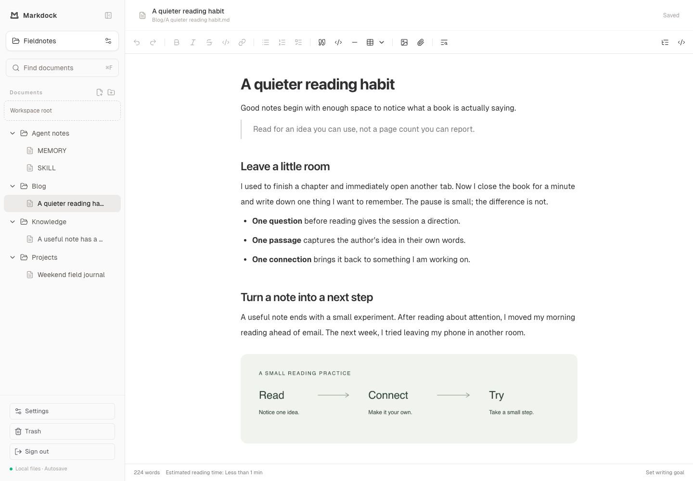
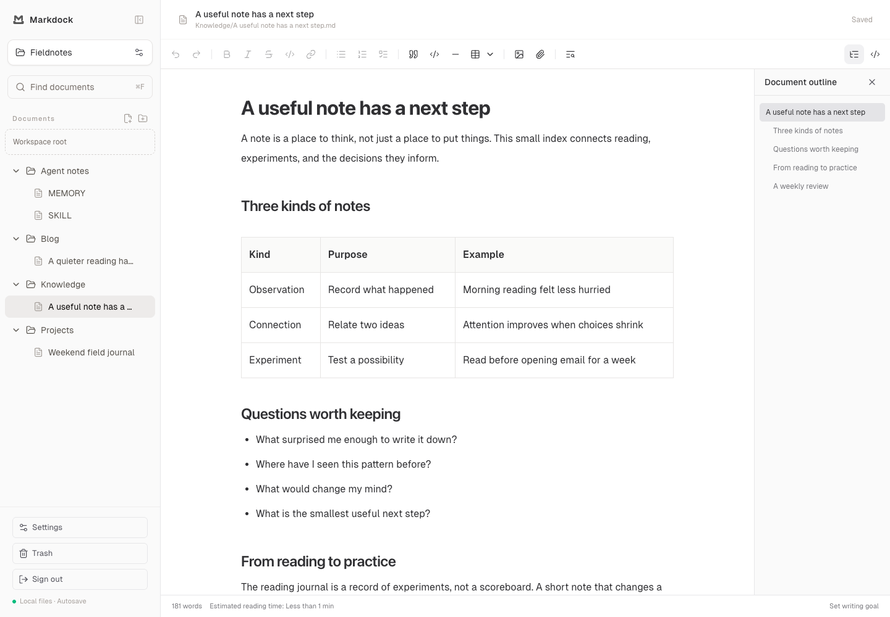
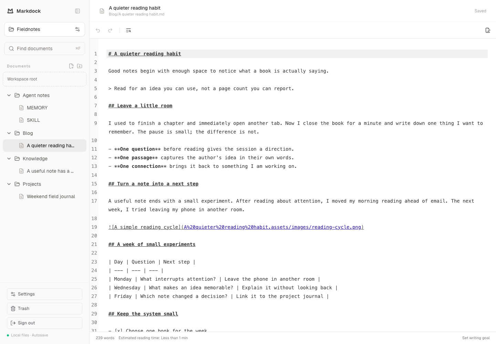
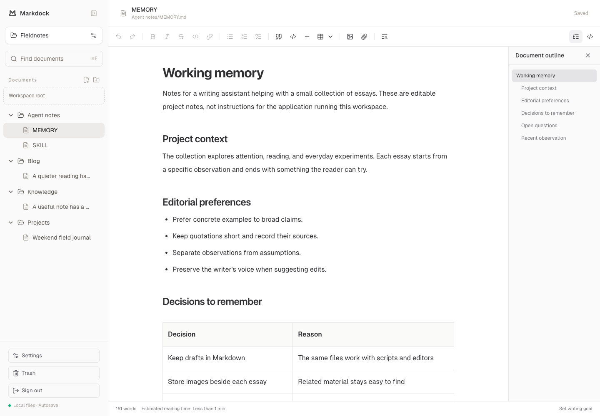

<p align="center"></p>
<h1 align="center">Markdock</h1>
<p align="center"><strong>Where Markdown docks.</strong><br>让 Markdown 有处停靠，文件始终由你掌握。</p>
<p align="center"><a href="README.md">English</a> · <strong>简体中文</strong></p>



在接近 Typora 的专注界面中写作，需要时切换到 Markdown 源码。Markdock 通过浏览器运行，直接编辑服务所在设备上的文件夹。

## 文件在手，思绪有处安放

- **自己的目录，自己的文件。** Markdown、图片和附件都保存在你控制的真实目录里。
- **一份文件，多种工具。** 继续使用其他编辑器、Git、脚本和 Agent。保存前会检查外部修改；请避免并发写入。
- **清爽的内容工作区。** 阅读、写作、搜索和整理，无需将笔记导入独立的内容数据库。

## 从 Docker 开始

已发布候选镜像 **`gudaojia/markdock:0.1.0-rc.1`**，包含 **AMD64 和 ARM64**。目前未发布 `latest`。候选版本可用于测试，目标服务器回归仍在进行。

需要 Docker Compose、两个已存在且可写的宿主机目录、非 root UID/GID，以及 HTTPS 反向代理。容器部署在局域网内也需要 HTTPS。本机源码运行见[部署说明](docs/ZH/01-deployment.md#本机源码部署)。

```sh
git clone https://github.com/GudaoJIA/MarkDock.git
cd MarkDock
cp .env.docker.example .env.docker
```

先编辑 `.env.docker`：

```dotenv
MARKDOCK_PUBLIC_ORIGIN=https://notes.example.com
MARKDOCK_CONFIG_PATH=/srv/markdock/config
MARKDOCK_DOCUMENTS_PATH=/srv/markdock/documents
MARKDOCK_UID=1000
MARKDOCK_GID=1000
MARKDOCK_HTTP_PORT=3000
```

替换域名和路径。两个目录必须预先存在，并授予选定的非 root 用户读写权限；配置目录放在文档目录之外。不要在此文件填写密码。

```sh
docker compose -f compose.image.yaml --env-file .env.docker pull
docker compose -f compose.image.yaml --env-file .env.docker run --rm --no-deps markdock node admin/auth-password.mjs
docker compose -f compose.image.yaml --env-file .env.docker up -d
```

首次部署在交互提示中设置密码。配置 HTTPS 代理转发到 `127.0.0.1:3000`，保留外部 `Host`，然后访问已配置的 HTTPS 地址登录。HTTP 后端有意只绑定宿主机回环地址；代理、权限及启动检查详见[完整部署说明](docs/ZH/01-deployment.md#https-反向代理)。

| 宿主机数据 | 容器路径 | 升级时保留 |
| --- | --- | --- |
| 服务配置 | `/var/lib/markdock` | 固定列表、密码哈希 |
| 文档目录 | `/workspaces` | Markdown、资源、工作区规则、备份、垃圾箱及恢复记录 |

打开“工作区管理”，浏览 `/workspaces`，固定一个已有文件夹。固定只建立入口，不移动或复制文件。

## 写作、整理、再回来

| 能力 | 用途 |
| --- | --- |
| 可视化与源码 | 共用草稿、自动保存和撤销历史 |
| Markdown 工具 | 标题、列表、待办、链接、表格、代码、图片与附件 |
| 导航 | 文档搜索、查找替换、大纲与章节折叠 |
| 文件管理 | 新建、重命名、移动文档，从垃圾箱恢复 Markdown 文件 |
| 资源规则 | 资源跟随文档，或存入工作区内固定目录 |
| 界面偏好 | 中英双语、浅色／深色／跟随系统、历史预算、自定义快捷键 |



<details>
<summary>查看同一篇文章的源码模式</summary>



源码模式可编辑完整文档，包括 YAML 文档头。无法安全表示的语法回退为可编辑原文；不承诺每次编辑后 Markdown 都逐字保持原样。

</details>

## 放进你的工作方式

**个人知识库——让知识有处安放。** 用普通 Markdown 文件维护阅读笔记、学习记录和项目索引。浏览目录、编辑、搜索文件名与正文；不提供知识图谱或语义搜索。

**博客写作——就在博客的目录里写。** 编辑已有内容目录中的文章和资源，继续通过原有工具构建与发布。YAML 文档头被保留，可在源码模式编辑；没有元数据表单或一键发布。

**Agent 文件维护——让指令与记忆可读。** 阅读、检查和编辑提示词、指令、记忆笔记与技能说明。`AGENTS.md`、`MEMORY.md`、`SKILL.md` 只是场景举例，并非统一规范。Markdock 编辑文件，不运行 Agent，也不安装技能。



## 文件保存在哪里

固定的文件夹就是工作区范围。资源规则属于工作区；语言、外观和编辑偏好属于浏览器。

```text
workspace/
├── essays/
│   ├── reading.md
│   └── reading.assets/       # 默认：资源跟随文档
│       ├── images/
│       └── file/
└── .markdock.json            # 保存工作区设置时创建
```

资源也可采用同名目录，或相对于工作区根的固定目录。更改规则只影响后续上传，不搬迁已有文件，详见[配置说明](docs/ZH/03-configuration.md)。

路径属于**运行服务的设备**，不是浏览器所在设备。Docker 只能访问已挂载的目录，并进一步受允许根配置限制。Markdock 提供单用户密码登录，不提供协同编辑或云同步，也不会执行 HTML、MDX 或 Agent 指令。

## 当前状态

首个双架构 Docker 候选镜像已发布，真实目标机器回归与跨版本升级仍属于发布验证工作。截图展示本次品牌改造后的界面；已发布的 `0.1.0-rc.1` 仍使用旧 Logo 和名称大小写。

近期重点是部署反馈、编辑体验和文档完善，不承诺发布日期。自动保存与垃圾箱不能替代备份；未保存草稿和撤销历史保存在页面内存。宽表格滚动、分隔线撤销时末尾空格丢失仍为已知限制。

## 使用说明与参与开发

从[部署](docs/ZH/01-deployment.md)、[快速上手](docs/ZH/02-getting-started.md)或[使用指南](docs/ZH/04-user-guide.md)开始。[备份与恢复](docs/ZH/05-backup-and-recovery.md)说明升级、外部修改冲突与恢复记录。

开发使用 Node.js 22 和 Bun 1.3.3。完成源码设置后，用 `bun run dev` 本地预览。提交改动前依次运行 `bun run build`、`bun run typecheck`、`bun run lint` 和 `bun run test:workspace`，用独立测试工作区验证。

[反馈问题](https://github.com/GudaoJIA/MarkDock/issues)时请附版本、部署方式和复现步骤，移除私人正文、凭证及路径。用户行为发生变化时，请同步维护中英文说明。

## 名字、致谢与许可

**Markdown** 是内容格式，**Mark** 是记录，**Doc** 是文档，**Dock** 是想法停靠与连接的地方。

基于 [Plate Playground Template](https://github.com/udecode/plate-playground-template)，使用 Plate、Slate、React、Next.js、shadcn/ui 和 Lucide。保留上游 [MIT 许可证与版权声明](LICENSE)；第三方依赖遵循各自许可。Logo 由项目维护者提供。
